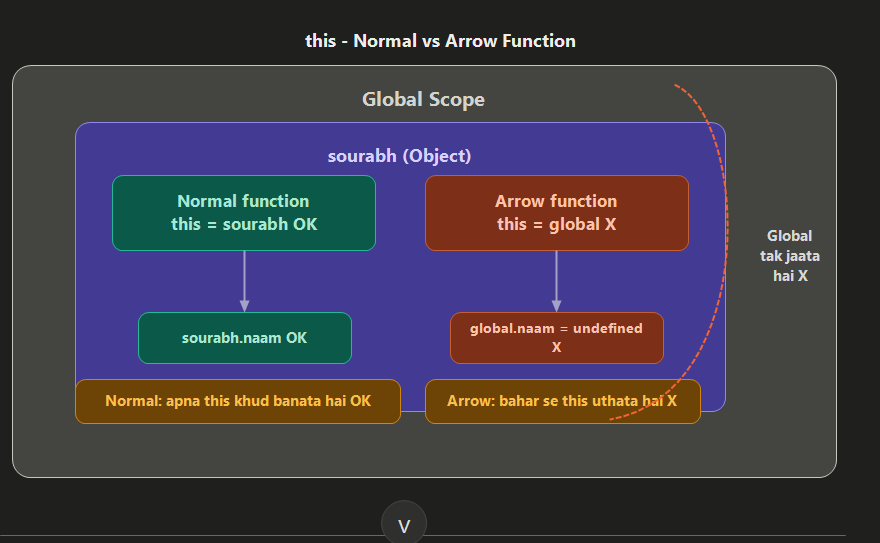

# Arrow Functions

Arrow function normal function ka short syntax hai. Kaam same ho sakta hai, lekin `this` ka behavior different hota hai.

## Object Mutable Hota Hai

```js
const sourabh = {
    naam: "Sourabh",
    introduce: function () {
        console.log(`Main ${this.naam} hoon`); // this.naam object ke current naam ko read karta hai
    }
};

sourabh.naam = "Sourabh Howale"; // object ki property baad me update kar sakte ho
sourabh.introduce();             // output: Main Sourabh Howale hoon
```

Object mutable hai, yani object ki value baad me change ho sakti hai.

## Normal Function vs Arrow Function

```js
function add(a, b) { // normal function: function keyword use hota hai
    return a + b;    // explicit return
}

const addArrow = (a, b) => a + b; // arrow function: short syntax, one-line return

console.log(add(2, 3));      // output: 5
console.log(addArrow(2, 3)); // output: 5
```

Normal function aur arrow function dono function hi hain. Arrow function bas shorter hota hai.

## `this` Ka Main Difference

```js
const user = {
    naam: "Sourabh",

    introduce: function () {
        console.log(this.naam); // output: Sourabh, normal method me this = current object
    },

    introduceArrow: () => {
        console.log(this.naam); // output: undefined, arrow function apna this nahi banata
    }
};

user.introduce();      // works: object ka naam milta hai
user.introduceArrow(); // undefined: object method ke liye arrow function avoid karo
```



## Simple Rule

Object method me normal function use karo.

```js
const user = {
    naam: "Sourabh",
    sayName: function () {
        console.log(this.naam); // correct: this user object ko refer karta hai
    }
};
```

Array methods me arrow function use karna perfect hai.

```js
const numbers = [1, 2, 3, 4, 5];

const doubled = numbers.map((n) => n * 2);   // har number ko 2 se multiply karta hai
console.log(doubled);                        // output: [2, 4, 6, 8, 10]

const evens = numbers.filter((n) => n % 2 === 0); // sirf even numbers rakhta hai
console.log(evens);                              // output: [2, 4]
```

Short memory trick: object method me normal function, callback/array method me arrow function.
